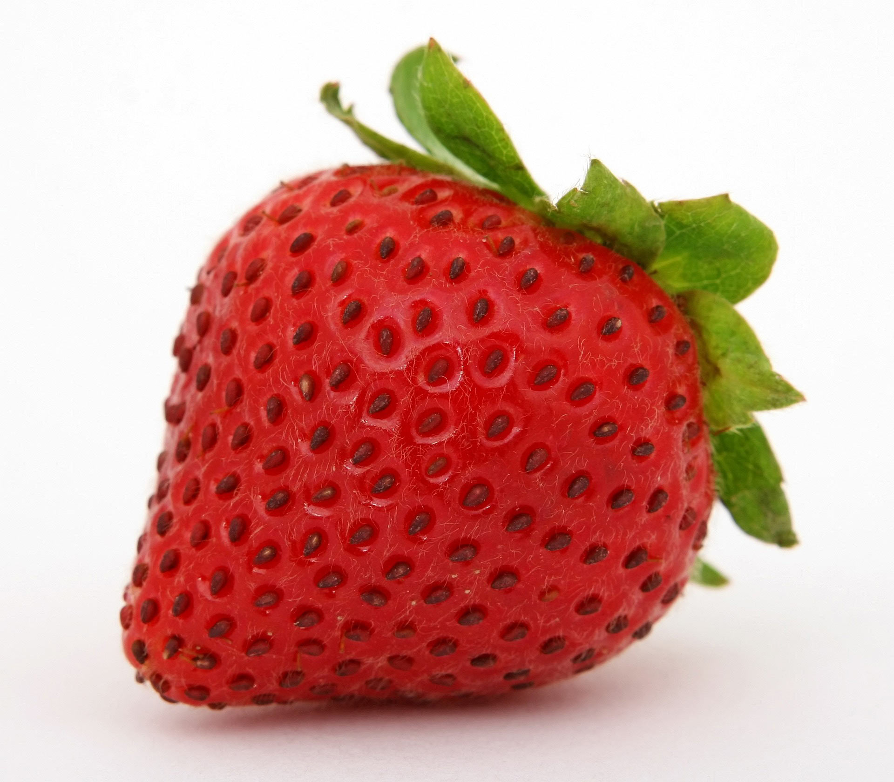
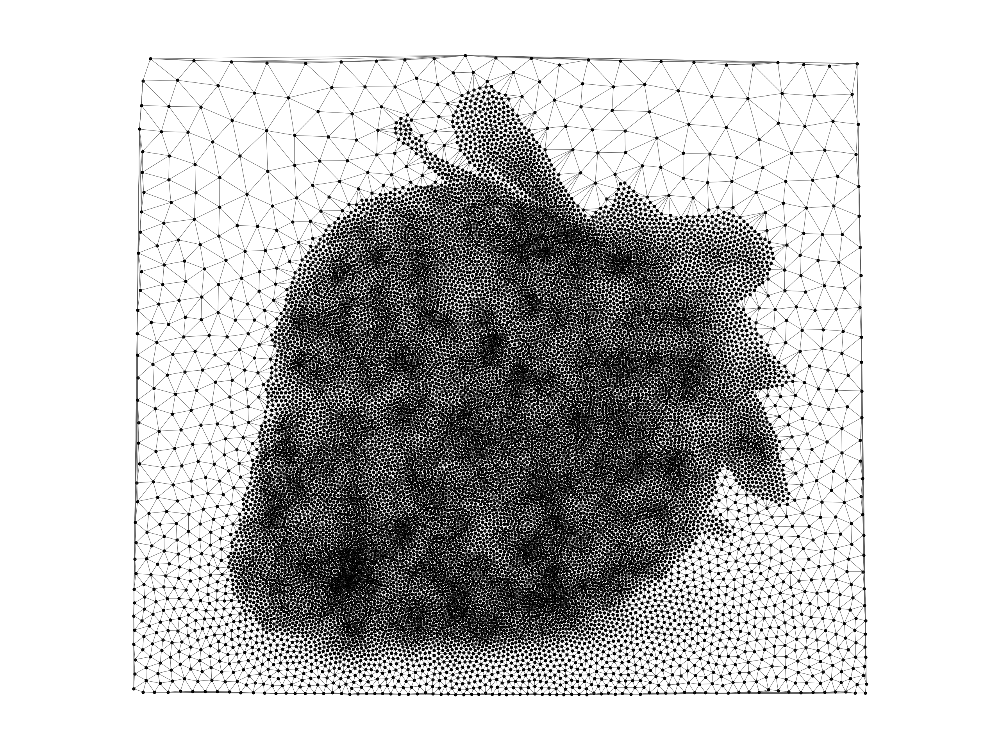
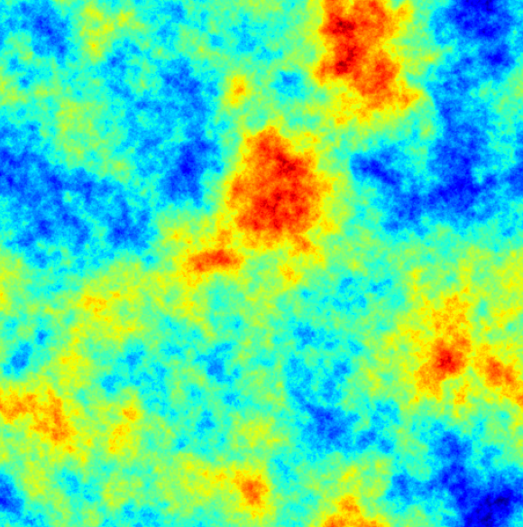
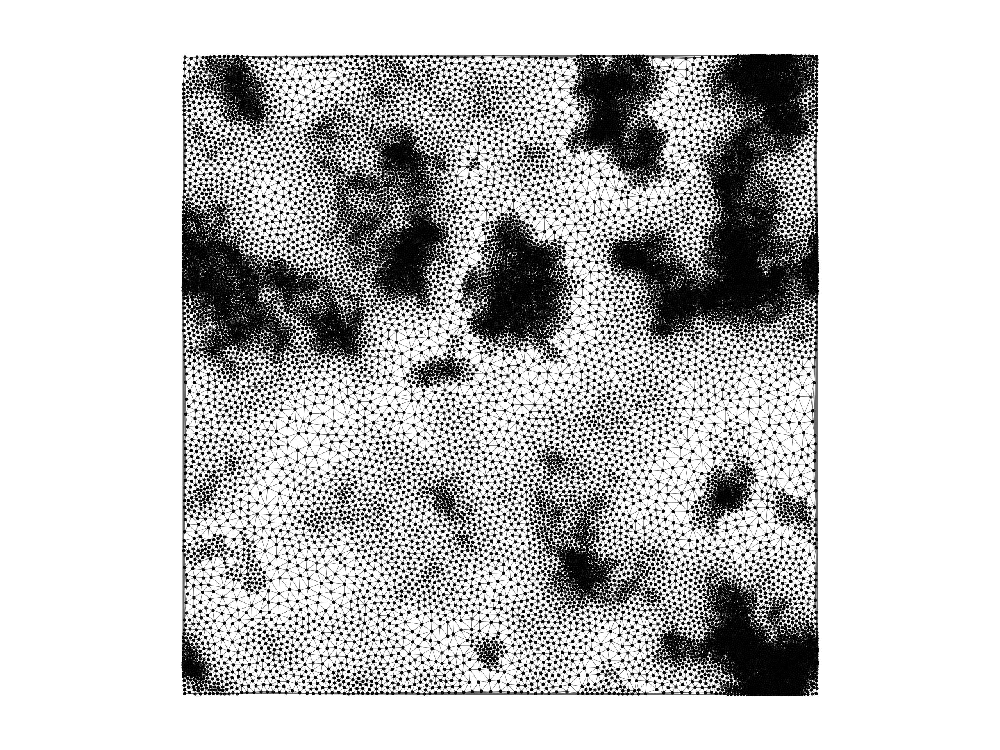
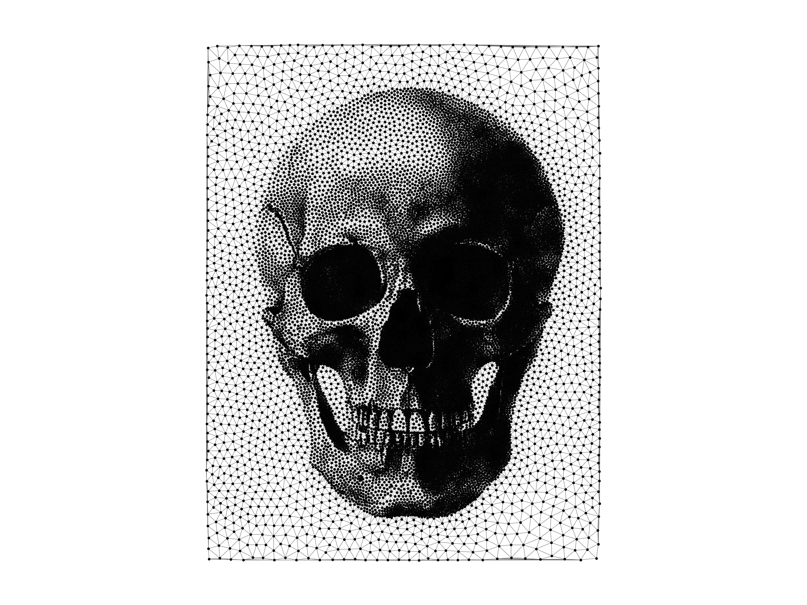

# Weighted Voronoi Stippling Mesher

## Information

+ **Author:** Evan John Ricketts
+ **Afffiliation:** Cardiff University
+ **Date:** April 27, 2024

## Description

Mesh generator based on weighted voronoi stippling, where an image is taken as input, and its luminosity dictates mesh density.


This can then be used in a number of ways, such as a finite element solver. Below is the solution of Poisson's equation with two souce terms.


## Sources of inspiration

+ [1] Journal article: [Paper link](https://www.cs.ubc.ca/labs/imager/tr/2002/secord2002b/secord.2002b.pdf) - Secord, A. (2002). Weighted Voronoi stippling. In Proceedings of the 2nd international symposium on Non-photorealistic animation and rendering. NPAR02: Non-Photorealistic Animation and Rendering. ACM. https://doi.org/10.1145/508530.508537

+ [2] Github repo: [Weighted voronoi stipplng](https://github.com/ReScience-Archives/Rougier-2017/tree/master/code) - Jannis Vamvas

+ [3] Github repo: [Particle Repulsion Mesher](https://github.com/vyastreb/ElectrostaticRepulsionMesher/blob/main/README.md) - Vlad Yastrebov

+ [4] YouTube video: [Coding Challenge 181: Weighted Voronoi Stippling](https://www.youtube.com/watch?v=Bxdt6T_1qgc&t=4s)

## Requirements

+ Python 3.7 or higher
+ Numpy
+ Numba
+ Matplotlib
+ PIL
+ Scipy
+ Tqdm


## Usage

The code -with default arguments- can be run from the command line as follows:

```bash
python main.py image_name.png
```

where it is assumed the images is in the `images` directory. 

The following parameters can be parsed
```python
    npoin = 30000       # Number of particles
    niter = 25          # Number of iterations
    save = False        # Save array of final points
    animate = False     # Animate the meshing process
    plot = False        # Plot final mesh
    dpi = 400           # Resolution of plots
```

## Examples

### Strawberry

Command: `python main.py sbry.jpg --npoin 20000 --niter 25 --plot`

  

### Random Field 3

Command: `python main.py RF3.png --npoin 20000 --niter 25 --plot`

  

### Skull

Command: `python main.py skull.png --npoin 20000 --niter 25 --plot`

  

## Note
The code is provided as is and the author is not responsible for any damage caused by the code. GPT4 was utilised in the construction of the code.
